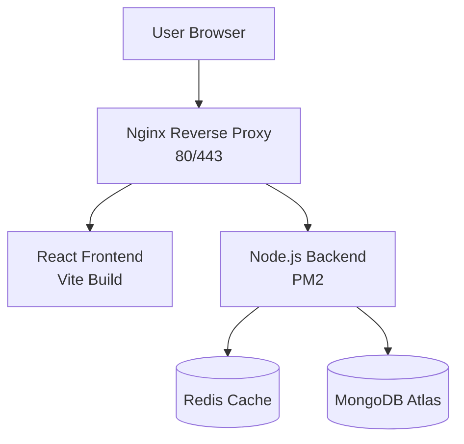
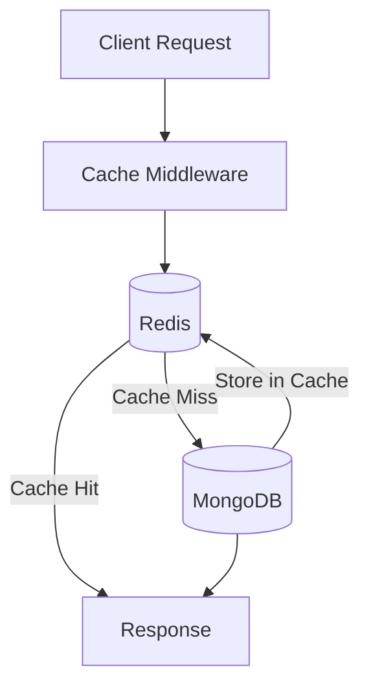
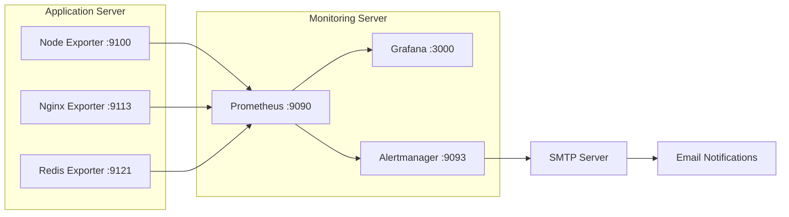

# MERN Bike Rental Application Deployment with Monitoring & Caching

## 🚀 Tech Stack
- React + Vite
- Node.js + Express
- MongoDB Atlas
- Redis
- Nginx
- PM2
- Prometheus
- Grafana
- Alertmanager
- AWS EC2

---

## 🏗️ Architecture

## Overall Architecture



This renders as a proper diagram and never gets displaced.

Redis Cache-Aside Architecture (Mermaid)
## Redis Cache-Aside Pattern


Monitoring Architecture (Mermaid)
## Monitoring Architecture



## ⚙️ Deployment Steps

### 1. Backend Deployment
- Clone repository
- Install dependencies
- Configure environment variables
- Start with PM2

### 2. Frontend Deployment
- Build React application
- Configure Nginx
- Enable HTTPS

---

## 🔥 Redis Integration

### Why Redis?
- Reduce database load
- Faster response times
- Cache frequently accessed APIs

### Cache-Aside Pattern

Client
↓
Redis (HIT → Return)
↓
MISS
↓
MongoDB
↓
Store in Redis
↓
Return Response

### Implementation

#### config/redis.js
(Short code snippet)

#### utils/cache.js
- getCache()
- setCache()
- deleteCache()

#### cacheMiddleware.js
- Dynamic cache key generation
- TTL support

#### Cache Invalidation
POST/PUT/DELETE
↓
Delete Cache
↓
Next Read → Fresh Data

---

## 📊 Monitoring Stack

### Exporters
- Node Exporter
- Nginx Exporter
- Redis Exporter

### Prometheus
- Scrape configurations
- Alert rules

### Grafana
- Infrastructure Dashboard
- Nginx Dashboard
- Redis Dashboard

### Alertmanager
- Email notifications
- Resolved alerts
- SMTP configuration

---

## 🚨 Alerts Configured

- Instance Down
- High CPU Usage
- High Memory Usage
- High Disk Usage
- Redis Exporter Down
- Nginx Exporter Down

---

## 🛠️ Useful Commands

PM2:
```bash
pm2 status
pm2 logs bike-backend
pm2 restart bike-backend

Redis:

redis-cli KEYS "*"
redis-cli TTL bikes:{}
redis-cli MEMORY USAGE bikes:{}

Prometheus:

promtool check config /etc/prometheus/prometheus.yml

Alertmanager:

amtool check-config /etc/alertmanager/alertmanager.yml

🎯 DevOps Concepts Implemented
Reverse Proxy
1.Process Management
2.Cache-Aside Pattern
3.Cache Invalidation
4.Infrastructure Monitoring
5.Alerting
6.Email Notifications
7.SSL Termination
8.Exporter Pattern
9.Centralized Monitoring
📚 Learning Outcomes
1.Production deployment using PM2 and Nginx
2.Redis caching strategies
3.Prometheus metrics collection
4.Grafana dashboard creation
5.Alertmanager email integration
6.Infrastructure observability
